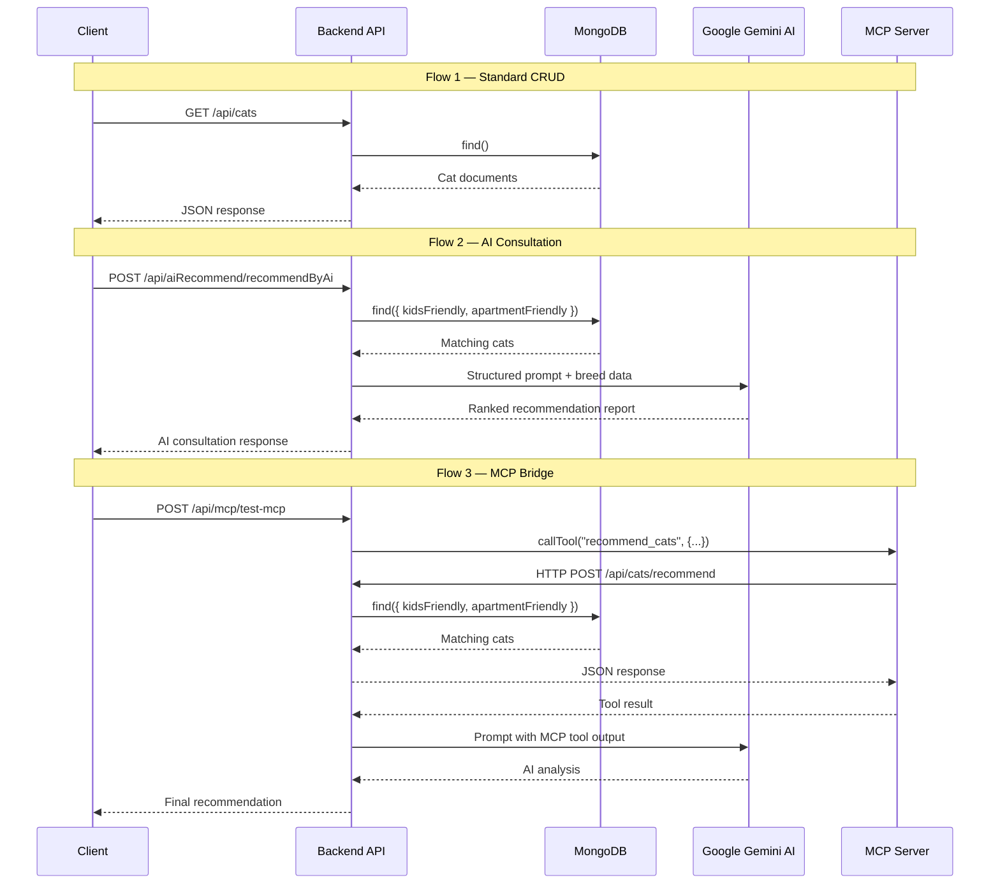

<div align="center">

# Tiny Cats

**AI-Powered Cat Breed Recommendation Engine & MCP Service**


A full-stack backend application that combines MongoDB-backed cat breed management with Google Gemini AI consultations and a Model Context Protocol (MCP) server — enabling intelligent, preference-based cat breed recommendations through both REST APIs and standardized MCP tool interfaces.

</div>

---

## Table of Contents

- [Overview](#overview)
- [Architecture](#architecture)
- [Data Model](#data-model)
- [API Reference](#api-reference)
- [MCP Server Tools](#mcp-server-tools)
- [Request Flow](#request-flow)
- [Getting Started](#getting-started)
- [Environment Variables](#environment-variables)
- [Scripts Reference](#scripts-reference)
- [Project Summary](#project-summary)
- [Contributing](#contributing)
- [License](#license)

---

## Overview

Tiny Cats is composed of two independent services that work together:

| Service | Description | Port |
|---------|-------------|------|
| **Backend API** | Express REST API with MongoDB persistence, Gemini AI integration, and MCP client bridge | `3000` |
| **MCP Server** | Standalone Model Context Protocol server exposing cat recommendation tools via stdio transport | N/A (stdio) |

### Key Capabilities

- **CRUD Operations** — Create, read, search, and filter cat breed profiles stored in MongoDB.
- **Regex-Based Search** — Case-insensitive search across `name` and `breed` fields.
- **Preference Filtering** — Filter breeds by lifestyle compatibility (`kidsFriendly`, `apartmentFriendly`).
- **AI Breed Consultation** — Structured prompting with Google Gemini 2.5 Flash that generates ranked recommendations with match scores, pros/cons analysis, and detailed breed comparisons.
- **MCP Tool Exposure** — Two registered MCP tools (`recommend_cats`, `get_all_cats`) validated with Zod schemas, accessible to any MCP-compatible client.
- **MCP ↔ REST Bridge** — Backend spawns the MCP server as a subprocess via `StdioClientTransport`, enabling seamless tool invocation from HTTP endpoints.

---

## Architecture

```text
tiny_cats/
│
├── backend/                        # Express REST API
│   └── src/
│       ├── config/
│       │   └── db.ts               # MongoDB connection manager
│       ├── controllers/
│       │   ├── cat.controller.ts   # Cat CRUD & filtering handlers
│       │   ├── ai.controller.ts    # Direct Gemini AI prompt handler
│       │   ├── aiRecommend.controller.ts  # AI breed consultation handler
│       │   └── test-mcp.controller.ts     # MCP client bridge handler
│       ├── models/
│       │   └── cat.model.ts        # Mongoose schema definition
│       ├── routes/
│       │   ├── cat.routes.ts       # /api/cats/*
│       │   ├── ai.routes.ts        # /api/ai/*
│       │   ├── aiRecommend.routes.ts  # /api/aiRecommend/*
│       │   └── test-mcp.routes.ts  # /api/mcp/*
│       ├── services/
│       │   ├── cat.service.ts      # Database query logic
│       │   ├── ai.service.ts       # Gemini SDK wrapper
│       │   ├── aiRecommend.service.ts  # AI consultation prompt builder
│       │   └── mcp.service.ts      # MCP StdioClientTransport manager
│       ├── types/
│       │   └── cat.types.ts        # ICat interface definition
│       ├── app.ts                  # Express app setup & route mounting
│       └── server.ts               # Entry point (dotenv, DB connect, listen)
│
├── mcp_server/                     # Model Context Protocol Server
│   └── src/
│       ├── tools/
│       │   └── recommendCats.tool.ts  # HTTP calls to backend API
│       └── index.ts                # Server init, tool registration, stdio transport
│
└── .gitignore
```

The project follows a **Controller → Service → Model** layered architecture with strict separation of concerns. Each layer has a single responsibility: controllers handle HTTP request/response, services encapsulate business logic, and models define the data schema.

---

## Data Model

### Cat Schema (`ICat`)

| Field | Type | Required | Default | Description |
|-------|------|----------|---------|-------------|
| `name` | `String` | ✅ | — | Name of the cat |
| `breed` | `String` | ✅ | — | Breed classification |
| `description` | `String` | ✅ | — | Detailed breed description |
| `lifeSpan` | `Number` | ❌ | `1` | Average life span in years |
| `energyLevel` | `String` | ✅ | — | Energy classification (e.g., Low, Medium, High) |
| `kidsFriendly` | `Boolean` | ❌ | `true` | Suitability for households with children |
| `apartmentFriendly` | `Boolean` | ❌ | `true` | Suitability for apartment living |
| `image` | `String` | ❌ | — | URL to breed image |
| `color` | `String` | ❌ | — | Coat color |
| `createdAt` | `Date` | — | auto | Mongoose timestamp |
| `updatedAt` | `Date` | — | auto | Mongoose timestamp |

---

## API Reference

> **Base URL:** `http://localhost:3000`

### Cat Management — `/api/cats`

| Method | Endpoint | Description |
|--------|----------|-------------|
| `POST` | `/api/cats/create` | Create a new cat record |
| `GET` | `/api/cats/` | Retrieve all cats |
| `GET` | `/api/cats/:id` | Retrieve a single cat by ID |
| `GET` | `/api/cats/search/all?q={query}` | Search cats by name or breed (regex) |
| `POST` | `/api/cats/recommend` | Filter cats by lifestyle preferences |

#### Example — Create Cat

```bash
curl -X POST http://localhost:3000/api/cats/create \
  -H "Content-Type: application/json" \
  -d '{
    "name": "Milo",
    "breed": "Persian",
    "description": "A calm and gentle breed known for its luxurious coat.",
    "lifeSpan": 15,
    "energyLevel": "Low",
    "kidsFriendly": true,
    "apartmentFriendly": true,
    "color": "White"
  }'
```

#### Example — Search

```bash
curl "http://localhost:3000/api/cats/search/all?q=persian"
```

#### Example — Recommend by Preferences

```bash
curl -X POST http://localhost:3000/api/cats/recommend \
  -H "Content-Type: application/json" \
  -d '{ "kidsFriendly": true, "apartmentFriendly": true }'
```

---

### AI Services — `/api/ai` & `/api/aiRecommend`

| Method | Endpoint | Description |
|--------|----------|-------------|
| `POST` | `/api/ai/ask` | Send a freeform prompt to Google Gemini 2.5 Flash |
| `POST` | `/api/aiRecommend/recommendByAi` | Generate a structured AI breed consultation report |

#### Example — Direct AI Prompt

```bash
curl -X POST http://localhost:3000/api/ai/ask \
  -H "Content-Type: application/json" \
  -d '{ "prompt": "What are the best cat breeds for first-time owners?" }'
```

#### Example — AI Breed Consultation

```bash
curl -X POST http://localhost:3000/api/aiRecommend/recommendByAi \
  -H "Content-Type: application/json" \
  -d '{ "kidsFriendly": true, "apartmentFriendly": false }'
```

The AI consultation endpoint first queries the database for matching breeds, then constructs a detailed prompt instructing Gemini to act as an expert Cat Breed Consultant. The response includes:

- **Top 5 ranked breeds** with match scores (XX/100)
- **Pros & Cons** for each breed
- **Key characteristics** (temperament, energy, grooming, intelligence, lifespan)
- **Final recommendation** with detailed rationale

---

### MCP Bridge — `/api/mcp`

| Method | Endpoint | Description |
|--------|----------|-------------|
| `POST` | `/api/mcp/test-mcp` | Invoke MCP `recommend_cats` tool, then process results through Gemini AI |

```bash
curl -X POST http://localhost:3000/api/mcp/test-mcp \
  -H "Content-Type: application/json" \
  -d '{ "kidsFriendly": true, "apartmentFriendly": true }'
```

---

## MCP Server Tools

The MCP server registers two tools using `@modelcontextprotocol/sdk` with Zod schema validation:

### `recommend_cats`

| Parameter | Type | Description |
|-----------|------|-------------|
| `kidsFriendly` | `boolean` | Whether the cat should be suitable for children |
| `apartmentFriendly` | `boolean` | Whether the cat should be suitable for apartments |

Calls `POST /api/cats/recommend` on the backend and returns matching breed data.

### `get_all_cats`

No parameters. Calls `GET /api/cats/` on the backend and returns all stored breed profiles.

---

## Request Flow



---

## Getting Started

### Prerequisites

| Requirement | Version |
|-------------|---------|
| Node.js | v18+ |
| MongoDB | v6+ (local or Atlas) |
| Google Gemini API Key | [Get one here](https://aistudio.google.com/) |

### Installation

```bash
# 1. Clone the repository
git clone <repository-url>
cd tiny_cats

# 2. Install backend dependencies
cd backend
npm install

# 3. Install MCP server dependencies
cd ../mcp_server
npm install
```

### Running

```bash
# Start the backend (with hot-reload)
cd backend
npm run dev
# → Server running at http://localhost:3000

# Start MCP server standalone (optional — backend spawns it automatically)
cd mcp_server
npm run dev
```

---

## Environment Variables

Create a `.env` file in the `backend/` directory:

```env
PORT=3000
MONGO_URI=mongodb://127.0.0.1:27017/tiny_cats
GEMINI_API_KEY=your_google_gemini_api_key
```

> **Note:** The `.env` file is excluded from version control via `.gitignore`. Never commit API keys to the repository.

---

## Scripts Reference

### Backend (`backend/`)

| Script | Command | Description |
|--------|---------|-------------|
| `dev` | `tsx watch src/server.ts` | Start development server with hot-reload |
| `build` | `tsc` | Compile TypeScript to JavaScript |
| `start` | `node dist/server.js` | Run compiled production build |

### MCP Server (`mcp_server/`)

| Script | Command | Description |
|--------|---------|-------------|
| `dev` | `tsx watch src/index.ts` | Start MCP server in development mode |
| `build` | `tsc` | Compile TypeScript to JavaScript |
| `start` | `node dist/index.js` | Run compiled production build |

---

## Project Summary

| Area | What Was Built |
|------|----------------|
| **Data Layer** | Mongoose schema with breed characteristics, lifestyle flags, physical traits, and automatic timestamps |
| **API Layer** | RESTful Controller → Service → Model architecture with structured error handling and consistent JSON responses |
| **AI Integration** | Google Gemini 2.5 Flash integration via `@google/genai` SDK for freeform prompting and structured breed consultation reports |
| **MCP Server** | Standalone MCP server with Zod-validated tool definitions (`recommend_cats`, `get_all_cats`) over stdio transport |
| **MCP Client Bridge** | Backend service that spawns MCP server subprocess via `StdioClientTransport`, invokes tools programmatically, and synthesizes results through Gemini AI |

---

## Contributing

1. Fork the repository
2. Create a feature branch (`git checkout -b feature/your-feature`)
3. Commit your changes (`git commit -m "Add your feature"`)
4. Push to the branch (`git push origin feature/your-feature`)
5. Open a Pull Request

---

## License

This project is licensed under the **ISC License**. See the `LICENSE` file for details.
